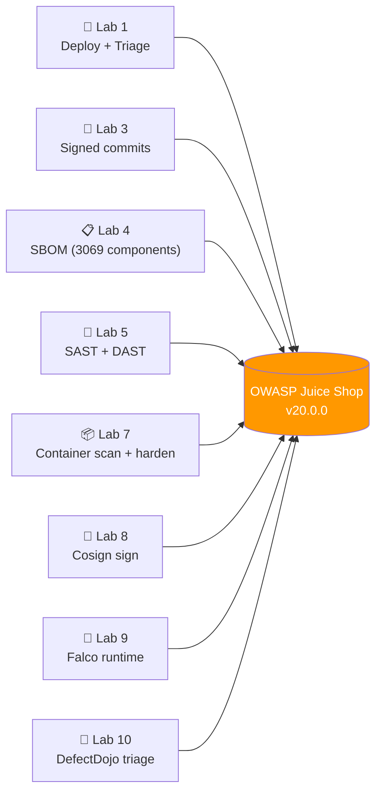
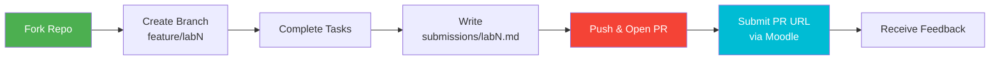

# DevSecOps Intro — Security as Code, From SDLC to Runtime


A hands-on elective course that teaches how to build a working DevSecOps program. You operate the same target — **OWASP Juice Shop** — across 10 weeks, applying a different defensive practice each lab: pre-commit secrets, signed commits, SBOM, SAST, DAST, IaC scanning, container hardening, supply-chain signing, runtime detection, and full-program triage in DefectDojo.

> *"Security is not a product, but a process."* — Bruce Schneier, *Secrets and Lies* (2000)

---

## Course Roadmap

The course follows a **map → discover → write → ship → scan → harden → sign → detect → triage** progression. Each week adds one defensive layer to the same Juice Shop target.

| Week | Lab | Module | Key Topics & Technologies |
|------|-----|--------|---------------------------|
| 1 | Lab 1 | Foundations & SDLC | OWASP Top 10:2025, Juice Shop deploy, PR workflow |
| 2 | Lab 2 | Threat Modeling | STRIDE, DFDs, trust boundaries, Threagile YAML |
| 3 | Lab 3 | Secure Git | SSH commit signing, pre-commit gitleaks, history rewrite with `git filter-repo` |
| 4 | Lab 4 | SBOM + SCA | Syft (CycloneDX 1.6 + SPDX), Grype, Trivy, sign-ready attestations |
| 5 | Lab 5 | SAST + DAST | Semgrep (`p/owasp-top-ten`), ZAP baseline + authenticated, cross-tool correlation |
| 6 | Lab 6 | IaC Security | Checkov 3.x on Terraform, KICS on Ansible + Pulumi, custom Checkov policies |
| 7 | Lab 7 | Container/K8s | Trivy image scan, Pod Security Standards (`restricted`), securityContext, NetworkPolicy, Conftest gate |
| 8 | Lab 8 | Supply Chain | Cosign v3 sign + verify + tamper demo, SBOM/SLSA attestations, `cosign sign-blob` |
| 9 | Lab 9 | Runtime + PaC | Falco (modern eBPF), custom rules, Conftest/Rego policies at CI time |
| 10 | Lab 10 | Vulnerability Management | DefectDojo capstone — import all prior labs, dedup, SLA matrix, MTTR/age, 5-min walkthrough |
| — | Lab 11 | Edge Hardening *(bonus)* | Nginx TLS 1.3, security headers, rate limiting, cert rotation; bonus: Coraza WAF + OWASP CRS |
| — | Lab 12 | VM Sandboxing *(bonus)* | Kata Containers, runc-vs-VM isolation, perf benchmark; bonus: real container-escape PoC blocked by Kata |

---

## The Project: OWASP Juice Shop

A deliberately-vulnerable web application maintained by Björn Kimminich since 2014; OWASP Flagship since 2018. The course pins **v20.0.0** (May 2026 release — Node 24, ~125 MB image, includes AI-themed prompt-injection challenges).



**You don't build the app; you make it secure.** Labs 2 (Threat Modeling), 6 (IaC), 11 (reverse proxy), and 12 (VM sandboxing) operate on adjacent scopes — playgrounds, model files, and infra — but Juice Shop is the thread connecting the others.

---

## Lectures + Readings

10 lectures, 17-25 slides each, 350-450 lines. Two readings replace lectures for the bonus labs.

| # | Title | File |
|--:|-------|------|
| 1 | DevSecOps Foundations: From "Add Security Later" to "Security Everywhere" | [lec1.md](lectures/lec1.md) |
| 2 | Threat Modeling: STRIDE, DFDs, and Threagile | [lec2.md](lectures/lec2.md) |
| 3 | Secure Git: Signed Commits, Secret Scanning, and History Hygiene | [lec3.md](lectures/lec3.md) |
| 4 | CI/CD Security: Treating the Pipeline as an Attackable System | [lec4.md](lectures/lec4.md) |
| 5 | SAST + DAST: Reading the Code, Then Watching It Run | [lec5.md](lectures/lec5.md) |
| 6 | IaC Security: Scanning Your Cloud Before It Burns | [lec6.md](lectures/lec6.md) |
| 7 | Container & Kubernetes Security: Scanning the Artifact, Hardening the Cluster | [lec7.md](lectures/lec7.md) |
| 8 | Supply Chain Security: Signing, Attestation, and the xz Backdoor | [lec8.md](lectures/lec8.md) |
| 9 | Monitoring, Compliance & Maturity: From Findings to a Program | [lec9.md](lectures/lec9.md) |
| 10 | Vulnerability Management: From 1 000 Findings to a Working Program | [lec10.md](lectures/lec10.md) |
| R11 | Reading — Web Edge Hardening | [reading11.md](lectures/reading11.md) |
| R12 | Reading — VM-Backed Containers + Confidential Computing | [reading12.md](lectures/reading12.md) |

---

## Technology Stack

All tools free and open-source (or have a meaningful free tier). Versions pinned to April-May 2026.

| Category | Tool | Version | Introduced |
|----------|------|---------|------------|
| Target app | OWASP Juice Shop | v20.0.0 | Week 1 (provided) |
| Containers | Docker / Docker Compose | 28.x | Week 1 |
| Threat modeling | Threagile | 0.9.1 | Week 2 |
| Pre-commit framework | pre-commit | latest | Week 3 |
| Secret scanning | gitleaks | 8.21.x | Week 3 |
| History rewrite | git-filter-repo | 2.45+ | Week 3 |
| SBOM | Syft | 1.41.x | Week 4 |
| SCA | Grype | 0.107.x | Week 4 |
| Multi-purpose scanner | Trivy | 0.69.x | Week 4, 6, 7 |
| SAST | Semgrep CE | 1.157.x | Week 5 |
| DAST | OWASP ZAP | stable (Checkmarx-maintained) | Week 5 |
| IaC scanning (Terraform) | Checkov | 3.2.x | Week 6 |
| IaC scanning (Ansible/Pulumi) | KICS | latest | Week 6 |
| Kubernetes | k3d (k3s in Docker) | v5.8.3 / k3s v1.31.x | Week 7 |
| Policy-as-Code | Conftest + OPA Rego | 0.68.x / 1.15.x | Week 7, 9 |
| Supply chain | Cosign | v3.0.x | Week 8 |
| Local registry | Distribution | v3 | Week 8 |
| Runtime detection | Falco | 0.43.x | Week 9 |
| Vulnerability mgmt | DefectDojo | v2.58.x | Week 10 |
| Bonus: Edge | Nginx | stable-alpine | Lab 11 |
| Bonus: VM sandbox | Kata Containers | v3.x | Lab 12 |

---

## What Ships vs What Students Produce

The course repo ships **only** lab specs, lecture notes, and plumbing files. Students produce all their artifacts in their fork.

| Path | Ships in repo | Students produce |
|------|:-------------:|:----------------:|
| `lectures/` | ✅ | |
| `labs/labN.md` | ✅ | |
| `labs/lab2/threagile-model.yaml` — Threagile baseline | ✅ | |
| `labs/lab5/scripts/` — ZAP auth config + helper scripts | ✅ | |
| `labs/lab6/vulnerable-iac/` — TF/Pulumi/Ansible samples | ✅ | |
| `labs/lab9/manifests/`, `labs/lab9/policies/` — K8s + Rego starters | ✅ | |
| `labs/lab10/imports/` — DefectDojo importer | ✅ | |
| `labs/lab11/docker-compose.yml`, `labs/lab11/reverse-proxy/nginx.conf` | ✅ | |
| `labs/lab12/scripts/` — Kata install/configure | ✅ | |
| `.github/PULL_REQUEST_TEMPLATE.md` — students write in Lab 1 | | ✅ |
| `.github/workflows/*.yml` — students add from Lab 1 bonus onward | | ✅ |
| `.pre-commit-config.yaml` — students write in Lab 3 | | ✅ |
| `labs/lab4/juice-shop.cdx.json` — SBOM regenerated each run | | ✅ (gitignored) |
| `labs/lab6/policies/my-custom-policy.yaml` — Lab 6 bonus | | ✅ |
| `labs/lab7/k8s/*.yaml` — hardened deployment | | ✅ |
| `labs/lab8/keys/cosign.pub` — public key (private gitignored) | | ✅ |
| `labs/lab9/falco/rules/custom-rules.yaml` | | ✅ |
| `submissions/labN.md` — lab reports, one per week | | ✅ |

The [`.gitignore`](.gitignore) keeps student-produced artifacts (`submissions/`, `.github/workflows/`, generated SBOMs, private keys, scan outputs) out of the course repo. Instructor-only reference submissions live in `refs/` and are also gitignored.

---

## Lab Structure

Each main lab (Labs 1-10) caps at **12 pts = 10 main + 2 bonus**.

| Task | Points | Description |
|------|-------:|-------------|
| **Task 1** | 6 pts | Core practice — advances the project; future labs depend on it. Required. |
| **Task 2** | 4 pts (3 in Lab 1) | Deeper dive into the week's topic. Skippable; project still works without it. |
| **Task 3** | 1 pt | *Lab 1 only* — GitHub community engagement. |
| **Bonus Task** | 2 pts | Extension for motivated students (flat 2 pts, not difficulty-weighted). |

A student who only completes Task 1 across all 10 labs ends with a working DevSecOps pipeline — just not all the deeper-dive controls.

**Bonus labs (11 + 12)** have a tighter shape: **Task 1 (4 pts) + Task 2 (4 pts) + Bonus Task (2 pts) = 10 pts total** (vs main labs' 12). The labs are bonus-track in the sense that they're not on the critical path; the Bonus Task inside each lab is still the genuinely-challenging extension. Bonus labs count toward a separate 20% weight (see grading below).

### Submission Workflow



Submissions are **CLI output + brief analysis**, not source code. Paste the commands you ran and what they printed; answer the questions at the end of each task in 2-3 sentences.

---

## Grading

Five components. Their max contributions sum to **139%** but the grade is **capped at 100%** — multiple paths to A; no single mandatory path.

| Component | Raw Points | Weight | What it rewards |
|-----------|-----------:|-------:|-----------------|
| **Main labs 1-10** (Task 1 + Task 2 + Task 3 where applicable) | 100 | **70%** | Diligent project work — the floor for any serious student |
| **Bonus tasks 1-10** (2 pts each, flat — no difficulty weighting) | 20 | **14%** | Going above and beyond on weekly topics |
| **Quiz leaderboards** (5 rolling per-2-labs leaderboards, top-10 share 1% pool each) | — | **up to 5%** | Engagement + excellence; rewards late-joining students too |
| **Bonus labs 11 + 12** (Task 1 + Task 2 + Bonus = 10 pts each) | 20 | **20%** | Edge hardening + VM-backed isolation |
| **Final exam** | — | **30%** | Optional path — written, comprehensive |
| **Sum (capped at 100%)** | | **139%** | |

### Paths to A

Two real paths to A (≥90%):

- **Practice path:** all main labs + bonuses + both bonus labs → ≥90%. No exam required.
- **Exam path:** all main labs + bonuses + decent exam → ≥90%. No bonus labs required.

Sample scores:

| Profile | Main | Bonuses | Bonus labs | Exam | Quiz | Total |
|---------|-----:|--------:|-----------:|-----:|-----:|------:|
| All Task 1 only | 42% | 0% | 0% | 0% | 0% | **42%** |
| All Task 1+2, no bonuses | 70% | 0% | 0% | 0% | 0% | **70%** |
| Add all weekly bonuses | 70% | 14% | 0% | 0% | 0% | **84%** |
| + good quiz | 70% | 14% | 0% | 0% | 5% | **89%** ← *just short of A* |
| + finish one bonus lab | 70% | 14% | 10% | 0% | 5% | **99%** ← *A territory* |
| + both bonus labs | 70% | 14% | 20% | 0% | 5% | **100%** (capped) |
| Take the exam instead | 70% | 14% | 0% | 25% | 5% | **100%** (capped) |

**The deliberate design:** `Main + lab-bonuses + quiz` alone tops out at **89% → just short of A**. To earn A you must do at least one bonus lab OR the exam. Stops "easy A from quiz padding."

### Quiz leaderboards (the 5%)

Five rolling windows, one per pair of labs:

| Window | Labs covered |
|--------|--------------|
| 1 | labs 1-2 |
| 2 | labs 3-4 |
| 3 | labs 5-6 |
| 4 | labs 7-8 |
| 5 | labs 9-10 |

Each window allocates a **1% pool** to its top 10 students. Late-joiners can still rank in later windows without being structurally disadvantaged.

### Performance tiers

| Grade | Range | Required to reach |
|-------|-------|-------------------|
| **A** | 90-100 | All main labs + at least one of: bonus labs / exam |
| **B** | 75-89 | Main labs + most bonuses, no extension work |
| **C** | 60-74 | Main lab Task 1 across most labs |
| **D** | 0-59 | Below expectations |

### Late submissions

Max 6/12 per lab if submitted within 1 week of deadline. No credit after 1 week.

---

## Required Software

<details>
<summary>Core (all weeks)</summary>

- Git ≥ 2.34, Docker ≥ 26, Docker Compose
- A terminal (bash/zsh)
- Text editor with Markdown support
- `curl`, `jq`

</details>

<details>
<summary>Per-week additions</summary>

| Week | Add |
|------|-----|
| 3 | `gitleaks` (v8.21+), Python 3.10+ with `pre-commit` + `git-filter-repo` |
| 4 | `syft`, `grype`, `trivy` |
| 5 | `semgrep` (`pip install`), ~3 GB free disk for Juice Shop source clone |
| 6 | `checkov` (`pip install --break-system-packages` if PEP-668), Docker for KICS |
| 7 | `k3d` v5.8+, `kubectl` v1.33+, `conftest` v0.68+ |
| 8 | `cosign` v3.x, optional: GitHub account for OIDC keyless signing |
| 9 | Linux kernel ≥ 5.8 (for modern eBPF); Falco runs in Docker but needs the host kernel |
| 10 | ~4 GB RAM headroom for DefectDojo |
| 11 *(bonus)* | `openssl`, `testssl.sh` (optional) |
| 12 *(bonus)* | Linux host with KVM (`/dev/kvm`), containerd. **Not** WSL2 by default (unless KVM enabled). |

</details>

---

## Repository Structure

```
DevSecOps-Intro/
├── README.md                      # This file
├── .gitignore                     # Keeps student artifacts + refs/ out
│
├── lectures/                      # 10 lectures + 2 readings (ships)
│   ├── lec1.md ... lec10.md
│   └── reading11.md, reading12.md
│
├── labs/                          # Lab specs + plumbing (ships)
│   ├── lab1.md ... lab12.md
│   ├── lab2/threagile-model.yaml          # Threat model baseline
│   ├── lab5/scripts/                       # ZAP auth config + helpers
│   ├── lab6/vulnerable-iac/                # TF/Pulumi/Ansible samples
│   ├── lab9/manifests/, lab9/policies/    # K8s + Rego starters
│   ├── lab10/imports/                      # DefectDojo importer
│   ├── lab11/docker-compose.yml, lab11/reverse-proxy/   # Nginx stack
│   └── lab12/scripts/, lab12/setup/        # Kata install
│
├── refs/                          # Instructor reference submissions (gitignored)
│   └── labN.md                    #   model answers per lab, captured from dry-runs
│
└── submissions/                   # (students write one report per lab, in their fork)
```

---

## Key Books & Resources

| 📖 Book | Author(s) | Why |
|---------|-----------|-----|
| **Threat Modeling: A Practical Guide for Development Teams** | Tarandach & Coles (O'Reilly, 2021) | Best modern primer; pairs with Threagile |
| **Web Application Security** | Andrew Hoffman (O'Reilly, 2020) | Companion to Juice Shop; explains what DAST is testing for |
| **Container Security** | Liz Rice (O'Reilly, 2020) | Ch. 11 on runtime security is the strongest book chapter on Falco's terrain |
| **Software Supply Chain Security** | Cassie Crossley (Manning, 2024) | Best single book on the L8 material |
| **Securing DevOps** | Julien Vehent (Manning, 2018) | Real Mozilla pipeline walkthrough; ch. 9-10 cover the L10 metrics + program loop |
| **Application Security Program Handbook** | Derek Fisher (Manning, 2023) | Best single book on program metrics + SLAs |

<details>
<summary>Standards & specs (bookmark these)</summary>

- [OWASP Top 10:2025](https://owasp.org/Top10/2025/) — current; built from 175k+ CVE records
- [OWASP Top 10 CI/CD Security Risks](https://owasp.org/www-project-top-10-ci-cd-security-risks/) — Lecture 4 framework
- [OWASP SAMM v2.0](https://owaspsamm.org/) — maturity model
- [SLSA v1.0](https://slsa.dev/spec/v1.0/) — supply-chain framework
- [NIST CSF 2.0](https://www.nist.gov/cyberframework) — Feb 2024 with new Govern function
- [Sigstore documentation](https://docs.sigstore.dev/) — Cosign + Fulcio + Rekor

</details>

<details>
<summary>Talks worth your time</summary>

- *"What Happens When Falco Detects?"* — Loris Degioanni, KubeCon EU 2024
- *"The xz Backdoor — Engineering Postmortem"* — Andres Freund, BSDCan 2024
- *"OWASP Top 10:2025 — What Changed and Why"* — Andrew van der Stock, Global AppSec 2025
- *"Sigstore: Software Signing for Everybody"* — Luke Hinds, KubeCon 2022

</details>

---

## Course Completion

By Week 10 you'll have:

- A working DevSecOps pipeline operating against OWASP Juice Shop with controls at pre-commit, build, deploy, and runtime
- A DefectDojo instance with all prior labs' findings deduped + triaged under an SLA matrix
- A 5-minute interview walkthrough script you can use in DevSecOps job interviews
- If you did the bonus labs: a production-grade Nginx reverse-proxy config + first-hand experience with VM-backed container sandboxing

**This is exactly the portfolio you'd walk through in a DevSecOps interview** — see the 5-minute walkthrough script in `submissions/lab10-walkthrough.md` (produced in Lab 10 bonus).
